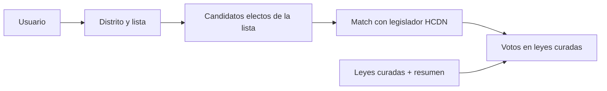

# Plan: Mi boleta → quién entró → cómo votó

## Decisiones Fase 0 (cerradas)

- **Repo / carpeta:** `mi-boleta` en `/home/agus/dev/mi-boleta` (no `~/Projects`).
- **Producto:** nombre público `mi-boleta` por ahora.
- **UI:** español; Tailwind 4; sin librería de UI; lucide si hace falta un ícono; tipografías después.
- **Stack:** Next 16 + App Router + TS + `src/` + npm + PapaParse + ESLint + Prettier + `AGENTS.md`.
- **Tema:** claro y oscuro, **configurable** (toggle + preferencia guardada).
- **Deploy:** **GitHub Pages** → `output: 'export'` (sitio estático); `basePath`/`assetPrefix` si el repo no es user/org pages root.
- **Remote:** `git@github.com:AgustinaNahas/mi-boleta.git` (visibilidad indistinta).
- **Datos:** `data/raw/` (gitignore) + `data/processed/` (en git) + `scripts/ingest/`; `featured_laws.json` vacío con schema; CSV de ejemplo consumido en home.
- **Docs:** dos READMEs — `README.md` (estructura/funcionamiento) + `FUENTES.md` (cada fuente de datos).
- **Git:** el usuario commitea **siempre**; el agente no crea commits.
- **Chat:** renombrar a `mi-boleta`.
- **Alcance piloto:** mencionar en docs CABA + Buenos Aires como piloto (criterio del agente).
- **Fase 0 incluye:** home con copy + demo leyendo CSV de ejemplo; no bajar HCDN aún.
- **Node:** usar nvm Node 22 (el PATH por defecto del shell a veces queda en 16).

### Checklist de ejecución Fase 0 (cuando pase a Agent)

1. `create_project` → `/home/agus/dev/mi-boleta` + `move_agent_to_root` + `rename_chat`.
2. `create-next-app` (TS, App Router, Tailwind, src, ESLint) con Node 22.
3. Prettier; `output: 'export'` + config GH Pages; theme provider claro/oscuro.
4. Carpetas data/scripts; `.gitignore` para `data/raw/`; processed seed + `featured_laws.json`; CSV ejemplo.
5. `lib/data.ts` + home que muestre filas del CSV; stub `npm run ingest`.
6. `README.md` + `FUENTES.md` + `AGENTS.md`.
7. `git remote add origin …` (sin commit del agente).
8. Parar antes de Fase 1.
## Qué estamos construyendo

Flujo principal:

1. Elegís **distrito** (p. ej. CABA, Buenos Aires) + **elección** (MVP: legislativas nacionales recientes).
2. Elegís la **lista/boleta** (agrupación + lista).
3. Ves **quiénes de esa lista obtuvieron banca**.
4. Para cada electo, ves **cómo votó** en un set de **leyes destacadas** (afirmativo / negativo / abstención / ausente).




**Supuestos del MVP (ajustables):**

- Solo **Diputados nacionales** (no Senado ni provinciales al inicio).
- Elecciones **2023 y 2025** (o la última disponible con listas + composición).
- **~15 leyes curadas** con resumen corto factual y link a fuente (no “score” ideológico).
- Stack: **Next.js (App Router) + TypeScript + CSVs/JSON locales** + scripts de ingest en Node/TS. **Sin base de datos** en el MVP.
- Repo: `mi-boleta` en `/home/agus/dev/mi-boleta`; deploy **GitHub Pages** (export estático).
- Commits: **solo el usuario**.

Hay productos cercanos ([Cómo Votó](https://comovoto.dev.ar/), [Congreso Abierto](https://congresoabierto.com/)) que muestran votos por legislador; el diferencial acá es el eje **boleta/lista → electos → votos**.

---

## Datos: CSVs locales (sin Supabase)

Sí: para este producto los datos son **casi estáticos**. Las votaciones de una ley ya cerrada no cambian; las listas de una elección tampoco. Solo hace falta **re-correr el ingest** cuando agregues leyes, un período nuevo, o corrijas un match.

**Por qué no Supabase en el MVP**

- Cero infra / auth / costos / schema migrations.
- El set que sirve la app es chico: ~15 leyes × ~257 diputados ≈ miles de filas, no millones.
- Todo vive en el repo (o en `data/` versionado / generado en CI) y Next lo lee en build o en el server.

**Estructura propuesta**

```
data/
  raw/           # descargas oficiales (pueden ir a .gitignore si son pesadas)
  processed/     # lo que consume la app
    lists.csv
    candidates.csv
    legislators.csv
    seats.csv              # quién entró de cada lista
    featured_laws.json     # curadas + resumen
    votes_featured.csv     # solo votos de esas leyes
    aliases.csv
scripts/ingest/  # download → normalize → write processed/
```

**Cómo lo lee Next:** helpers en `lib/data.ts` que parsean CSV/JSON (p. ej. con `csv-parse` o JSON precompilado). Para el MVP alcanza leer en Server Components; si hace falta velocidad, un paso `npm run build:data` que genere `data/processed/*.json` indexados por `listId`.

**Cuándo sí valdría una DB después:** búsqueda full-text de todas las actas históricas, updates diarios automáticos, usuarios guardando “mi lista”, o queries ad-hoc pesadas. No es el caso ahora.

**Matiz:** los dumps crudos de *todas* las votaciones nominales sí pesan; por eso el ingest **recorta** a las leyes curadas (y opcionalmente guarda el raw fuera de git).

---

## Respuesta directa: ¿puedo bajar yo las bases?


| Dato                                     | ¿Se puede bajar?                       | Fuente                                                                                                                                                                               | Quién lo hace                                                                                          |
| ---------------------------------------- | -------------------------------------- | ------------------------------------------------------------------------------------------------------------------------------------------------------------------------------------ | ------------------------------------------------------------------------------------------------------ |
| Votos nominales Diputados                | Sí, muy bien                           | [datos.hcdn.gob.ar](https://datos.hcdn.gob.ar/dataset/votaciones_nominales) (CSV/JSON + API CKAN); también [ArgentinaDatos](https://argentinadatos.com/) `/v1/diputados/actas/{año}` | Yo, scripts de ingest                                                                                  |
| Nómina / composición actual de diputados | Sí                                     | HCDN datos abiertos “Diputados” + ArgentinaDatos `/v1/diputados/diputados`                                                                                                           | Yo                                                                                                     |
| Resultados por lista (votos)             | Sí                                     | [DINE / resultados.mininterior.gob.ar](https://resultados.mininterior.gob.ar/) (CSV + API)                                                                                           | Yo                                                                                                     |
| Listas ordenadas de candidatos (boleta)  | Parcial / más frágil                   | [CNE candidaturas / boletas](https://www.electoral.gob.ar/) (Excel/PDF/HTML, no API limpia única)                                                                                    | Yo intento scrape/parse; **puede hacer falta ayuda manual** si el formato de un año/distrito es basura |
| Quién “entró” de cada lista              | Derivado                               | Orden de lista + bancas asignadas (D’Hondt / paridad) o cruce con electos oficiales                                                                                                  | Scripts + validación                                                                                   |
| Senado votos                             | Más trabajo                            | Scraping senado.gob.ar / proyectos como [Como_voto](https://github.com/rquiroga7/Como_voto)                                                                                          | Fase 2                                                                                                 |
| Resúmenes de leyes                       | No hay dataset “objetivo” oficial útil | Curación editorial + texto del expediente / Boletín                                                                                                                                  | Nosotros (contenido)                                                                                   |


**Conclusión:** no tenés que ir a buscar a mano las votaciones ni la composición: eso lo bajamos. Lo que **sí puede pedirte tiempo** es validar listas de candidatos raros / mismatches de nombres, y escribir (o aprobar) los resúmenes de las leyes curadas.

Referencias útiles ya existentes para no reinventar scraping: [nahuelhds/votaciones-ar](https://github.com/nahuelhds/votaciones-ar), [rquiroga7/Como_voto](https://github.com/rquiroga7/Como_voto), ArgentinaDatos.

---

## El problema difícil (y el núcleo técnico)

No es “mostrar votos”: es **unir tres mundos con IDs distintos**:

1. **Candidato en boleta** (nombre + orden + distrito + agrupación/lista).
2. **Diputado en HCDN** (id interno, bloque, período).
3. **Voto en acta** (afirmativo/negativo/abstención/ausente).

Plan de matching:

- Normalizar nombres (mayúsculas, acentos, “DE LA”, segundo apellido).
- Match primario: `apellido + nombre + distrito`.
- Match secundario: fuzzy + revisión de conflictos.
- Archivo `aliases.csv` para correcciones manuales (inevitable en AR).
- Columna `match_confidence` y UI que no invente: si no matchea, mostrar “electo, sin vínculo a votos aún”.

Bancas: para MVP, preferir **lista de electos oficiales** (composición HCDN + mandato) cruzada con **a qué lista pertenecían**, en vez de reimplementar D’Hondt perfecto en todos los distritos. Si falta el vínculo lista↔electo en alguna fuente, ahí sí usamos orden de lista + bancas por agrupación del escrutinio.

---

## Modelo de datos (archivos processed)

Mismos conceptos, como CSV/JSON en lugar de tablas:

- `elections.csv` — año, tipo (PASO/general), cargo
- `districts.csv` — provincias / CABA
- `lists.csv` — agrupación + nombre de lista + número + distrito + elección
- `candidates.csv` — persona, orden en lista, list_id
- `legislators.csv` — id HCDN, foto, bloque, período
- `seats.csv` — candidate_id → legislator_id (si entró)
- `featured_laws.json` — título corto, resumen, fecha, link, id de acta HCDN
- `votes_featured.csv` — legislator_id, law_id, value (AFIRMATIVO|NEGATIVO|ABSTENCION|AUSENTE)
- `aliases.csv` — correcciones de matching

Ingest: scripts `scripts/ingest/*` que bajan CSV/API → escriben `data/processed/*`. La app **nunca** scrapea en runtime.

---

## Curación de leyes (lo subjetivo)

Para no fingir objetividad total:

- Empezar con **lista editorial explícita** (“selección de leyes destacadas del período”).
- Cada ítem: **título amigable**, **1–3 oraciones factuales** (qué hace / qué se votó), **link** a acta HCDN o Infoleg, y si aplica “votación en general”.
- Opcional fase 2: ranking automático de votaciones “divididas” (margen estrecho) como sección “otras votaciones polémicas”, separado de la curada.

Vos podés proponer las 15 leyes; yo ayudo a armar textos cortos y a linkear actas.

---

## Producto / UI (Next)

Páginas mínimas:

- `/` — explicar el producto + CTA “Elegí tu lista”
- `/elegir` — wizard distrito → elección → búsqueda de lista
- `/lista/[id]` — electos de esa lista + grilla de votos en leyes destacadas
- `/ley/[id]` — detalle de una ley + cómo votó cada electo de *tu* lista (y opcionalmente todo el recinto)
- `/metodologia` — fuentes, matching, disclaimer de curación

UX: priorizar claridad (AFIRMATIVO en verde, etc.) sin “score de traición”. El valor es **transparencia de hechos**, no ranking moral.

---

## Fases de implementación

### Fase 0 — Setup

**Estado:** **hecha** (2026-08-07). Scaffold en `/home/agus/dev/mi-boleta`, home + CSV ejemplo, tema claro/oscuro, README + FUENTES + AGENTS, remote `AgustinaNahas/mi-boleta`, workflow GH Pages. Sin commits del agente; pendiente el primer commit tuyo. Sin ingest HCDN (eso es Fase 1).

### Fase 1 — Pipeline de votos (lo más sólido)

**Estado:** **hecha** (2026-08-07).

- Download/process separados (`ingest:download` con `--force`, `ingest:process`).
- Fuentes: ArgentinaDatos actas 2020–2026 + diputados; HCDN composición + dump histórico CKAN (stale).
- 15 leyes en `featured_laws.json` (incluye universitario y Garrahan).
- Processed: `legislators.csv`, `votes_featured.csv` (voto + voto_raw).
- Home: explorer de votos reales por ley + filtro CABA/BA.
- Hallazgo: el dump CKAN de votaciones HCDN no cubre 2024–2025; ArgentinaDatos es la vía práctica.

### Fase 2 — Listas y electos

**Estado:** **hecha para piloto 2023+2025** (2026-08-07).

- Generales **2023 y 2025** CABA+BA desde Excel oficial CNE.
- Match: 2023 47/47; 2025 47/48 (`Olmos, Kelly` en review).
- UI `/elegir` con ambas elecciones.
- Solo fuentes oficiales.

### Fase 3 — Producto ciudadano

- Wizard “elegí tu lista” + vista de votos en leyes curadas.
- Página de metodología y fuentes.

### Fase 4 — Extensiones

- Más distritos / años.
- Senado.
- Sección automática de votaciones divididas.
- Comparar “tu lista” vs otra.

---

## Riesgos a tener en cuenta

- **Nombres no matchean** entre boleta y HCDN → aliases + revisión.
- **CNE no publica un dump limpio uniforme** → parsers por año; a veces Excel.
- **Solo votaciones nominales** quedan registradas persona a persona (las votaciones “en conjunto” no sirven para este producto).
- **Sesgo de curación** → transparencia en `/metodologia`.
- Dependencia de terceros (ArgentinaDatos): preferir **fuente primaria HCDN** para votos y usar ArgentinaDatos solo como atajo si conviene.

---

## Qué haría yo vs qué necesitamos de vos

**Yo:** bajar e ingestir votos HCDN, composición, resultados DINE donde aplique; CSVs/JSON processed; app Next; parsers de listas; matching; UI; textos base de metodología.

**Vos (ligero):** confirmar nombre del proyecto; aprobar/proponer las ~15 leyes del MVP; revisar mismatches de nombres en distritos piloto si aparecen; opcionalmente aportar Excel/PDF de CNE si un año no scrapeable.